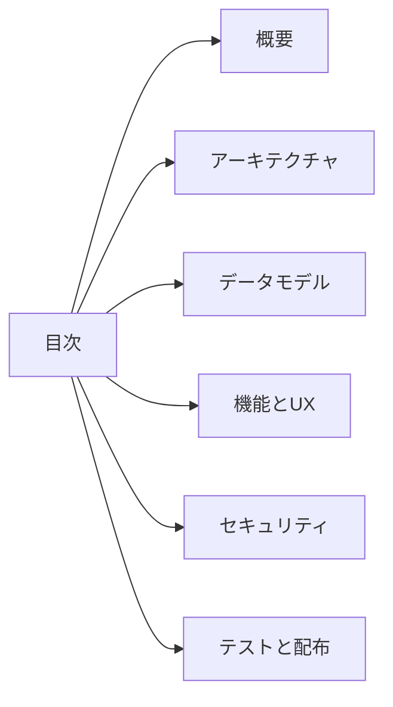

# 📚 目次

TeraDock の設計と実装計画を素早くたどれるよう、各ページの概要とリンクをまとめた。未着手の実装フェーズでも、何を優先すべきかを俯瞰できる順序になっている。全体の入り口としては `README.md` からも同じ内容に辿れる。

- [🌅 1. 概要](./01-概要.md) — 目的、対応環境、到達イメージを一気に把握。
- [🏗️ 2. アーキテクチャ](./02-アーキテクチャ.md) — レイヤー構造と外部コマンド依存の整理。
- [🗄️ 3. データモデル](./03-データモデル.md) — SQLite スキーマと保存場所の確認。
- [🎛️ 4. 機能とUX](./04-機能とUX.md) — CLI/TUI 操作フローと優先機能のまとめ。
- [🔒 5. セキュリティと秘密管理](./05-セキュリティと秘密管理.md) — 暗号化方針と漏洩防止策。
- [🧪 6. テストとリリース計画](./06-テストとリリース計画.md) — 壊れやすい箇所の検証と配布手順。

