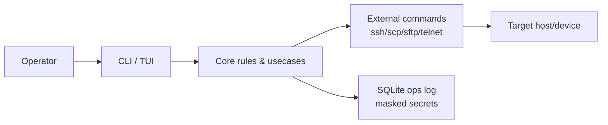

# 🌅 概要

## 目的とスコープ
TeraDock は Windows / Linux 両対応のターミナル中心ツールとして、プロファイル管理から接続・転送・設定配布・暗号化されたシークレット管理までを一貫して提供する。外部コマンドを利用し、SSH/Telnet/Serial を段階的にカバーすることで、現場運用の速度と安全性を両立する。【F:EXTERNAL_DESIGN.md†L3-L32】

## 対応環境と前提
- 対応OS: Windows 10/11 と Linux（ディストリ依存なし）。【F:EXTERNAL_DESIGN.md†L21-L24】
- 実行方針: 自前プロトコル実装を避け、ssh/scp/sftp/telnet など OS 提供コマンドに委譲する。【F:EXTERNAL_DESIGN.md†L25-L32】
- 配布: Windows は Inno Setup、Linux は `cargo-deb` と `tar.gz` を想定し、CI でマトリクスビルドを行う。【F:PROJECT_PLAN.md†L375-L389】

## 到達イメージ（v0.1最低ライン）
- `td doctor` が依存不足を正しく指摘し、SSH connect/exec/run、scp/sftp 転送、Config 配布が動く。【F:PROJECT_PLAN.md†L585-L599】
- Secret は暗号化保存し、`show` では非表示、master 設定済みなら `reveal` で確認可能。【F:PROJECT_PLAN.md†L590-L595】
- TUI で検索してプロファイル選択→ connect/exec/run が可能。【F:PROJECT_PLAN.md†L595-L598】

## 価値の流れ


## 想定コマンド例
```bash
# Dependency check (fails fast when ssh/scp/sftp/telnet missing)
td doctor --format text

# JSON-friendly execution output schema is fixed
# ok, exit_code, stdout, stderr, duration_ms, parsed【F:PROJECT_PLAN.md†L202-L208】
td exec p_example "uptime" --format json
```

他の詳細は [アーキテクチャ](./02-アーキテクチャ.md) と [機能とUX](./04-機能とUX.md) を参照。
