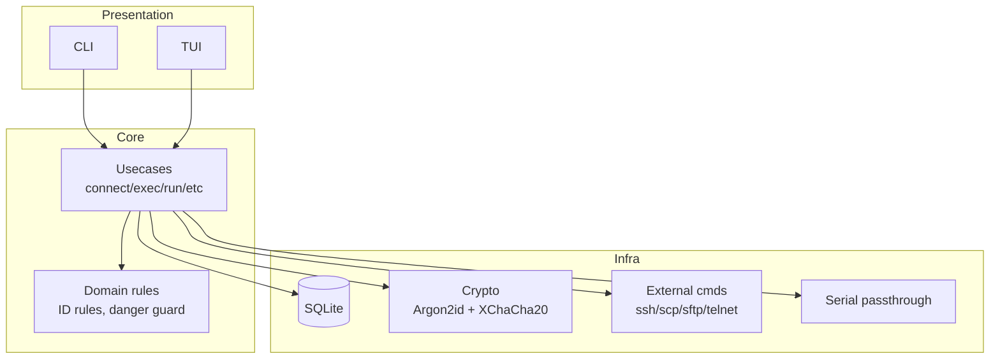
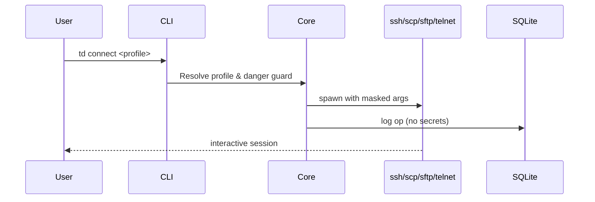

# 🏗️ アーキテクチャ

## ワークスペース構成（計画）
- `crates/core`: ドメインモデル、ユースケース、永続化、暗号、外部コマンド生成。【F:PROJECT_PLAN.md†L26-L44】
- `crates/cli`: clap ベースの CLI フロントエンド（ユースケース API 呼び出しのみ）。【F:PROJECT_PLAN.md†L26-L33】
- `crates/tui`: ratatui + crossterm による TUI（検索・確認・実行）。【F:PROJECT_PLAN.md†L26-L46】
- `crates/common` (任意): ID 正規化や共通エラー型の共有層。【F:PROJECT_PLAN.md†L26-L33】



## 外部依存と OS 差分
- 接続・転送は OS の外部コマンドを直接起動し、シェルは介さない（インジェクション回避）。【F:PROJECT_PLAN.md†L181-L199】
- クライアント解決は profile override → global settings → PATH 探索の順で決定する。【F:PROJECT_PLAN.md†L190-L195】
- `td doctor` で ssh/scp/sftp/telnet の有無と TUI 実行可否を検査し、欠落時に代替案を提示する。【F:EXTERNAL_DESIGN.md†L35-L53】

## コマンドパイプライン（概念）


## 予定されるディレクトリスケッチ
```bash
crates/
  core/        # Domain + usecases + infra adapters
  cli/         # CLI args -> core API
  tui/         # Ratatui screens & actions
  common/      # Shared validators & error types (optional)
```

詳細なテーブル構造は [データモデル](./03-データモデル.md)、操作フローは [機能とUX](./04-機能とUX.md) を参照。
