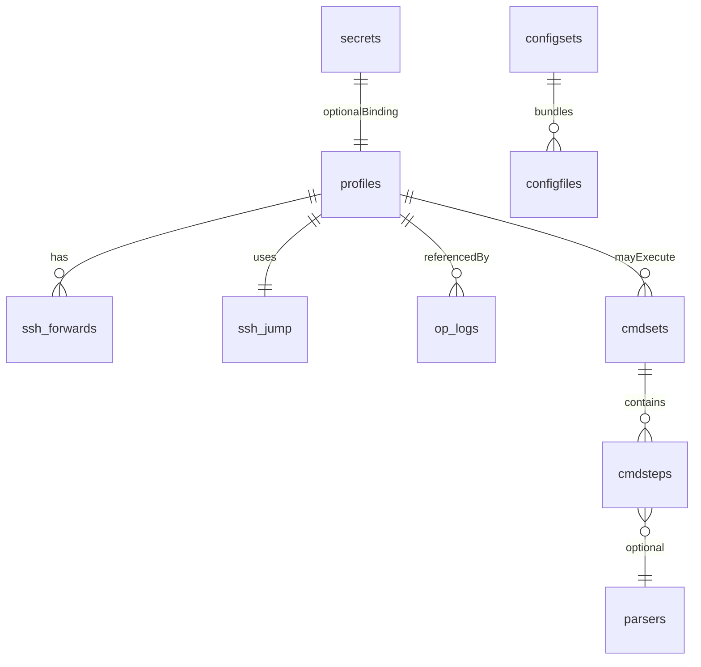

# 🗄️ データモデル

## ストレージ配置と形式
- 実行時 DB は SQLite、Windows は `%APPDATA%/TeraDock/teradock.db`、Linux は `~/.config/teradock/teradock.db` に置く。【F:PROJECT_PLAN.md†L50-L66】
- Export/Import は JSON 基本（必要に応じて TOML を追加）。【F:PROJECT_PLAN.md†L52-L55】
- ログファイルは同ディレクトリ配下の `logs/` に保存し、Secret を含めない。【F:PROJECT_PLAN.md†L60-L64】【F:PROJECT_PLAN.md†L338-L343】

## テーブル概要
- `settings`: キー値ストア（例: `schema_version`, client overrides）。【F:PROJECT_PLAN.md†L68-L129】
- `profiles`: 接続先メタデータと client overrides。【F:PROJECT_PLAN.md†L72-L83】
- `ssh_forwards` / `ssh_jump`: SSH 専用の forward と jump 設定。【F:PROJECT_PLAN.md†L78-L85】
- `secrets`: Argon2id + XChaCha20 で暗号化したシークレット本体。【F:PROJECT_PLAN.md†L85-L92】
- `cmdsets` / `cmdsteps` / `parsers`: コマンドセットと出力パーサ定義。【F:PROJECT_PLAN.md†L92-L107】【F:PROJECT_PLAN.md†L286-L317】
- `configsets` / `configfiles`: 設定配布ユニットと配布対象ファイル。【F:PROJECT_PLAN.md†L107-L116】【F:PROJECT_PLAN.md†L264-L283】
- `op_logs`: 監査用の実行ログ（Secret は含めない）。【F:PROJECT_PLAN.md†L117-L127】【F:PROJECT_PLAN.md†L338-L343】



## サンプルスキーマ抜粋
```sql
-- profiles capture host info and client overrides
CREATE TABLE profiles (
  profile_id TEXT PRIMARY KEY,
  name TEXT NOT NULL,
  type TEXT NOT NULL, -- ssh | telnet | serial
  host TEXT,
  port INTEGER,
  user TEXT,
  danger_level TEXT,
  client_overrides_json TEXT,
  created_at INTEGER,
  updated_at INTEGER,
  last_used_at INTEGER
);
-- Source: PROJECT_PLAN.md L72-L83
```

## 移行とスキーマバージョン
- `schema_version` を `settings` で保持するか、`refinery` などのマイグレーションツールで段階適用する方針。【F:PROJECT_PLAN.md†L128-L129】
- 新しいテーブル追加時は idempotent なマイグレーション手順を用意し、`td --version` 実行時に自動適用する計画。【F:PROJECT_PLAN.md†L397-L408】

詳細な操作手順は [機能とUX](./04-機能とUX.md) を参照。
