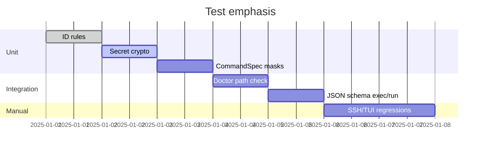
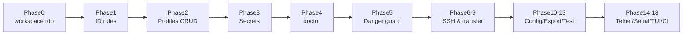

# 🧪 テストとリリース計画

## 壊れやすい箇所とテスト方針
- ID 正規化・予約語拒否、Export/Import のスキーマ互換、CommandSpec 生成で Secret 混入がないことをユニットテストで保証。【F:PROJECT_PLAN.md†L348-L360】
- Secret 暗号化は encrypt/decrypt 一致と AAD 不一致時の復号失敗を検証。【F:PROJECT_PLAN.md†L352-L357】
- FTP ガードは設定未指定時に拒否し、フラグ無しでも拒否することをテストする。【F:PROJECT_PLAN.md†L357-L360】
- 結合テスト: `td doctor` の PATH 差分検知と `--format json` スキーマ検証を重視。【F:PROJECT_PLAN.md†L362-L366】
- 手動試験: SSH connect/exec/run、Config apply（backup/plan）、TUI 検索・実行を v0.1 必須とする。【F:PROJECT_PLAN.md†L367-L371】



## 実装フェーズと成果物
- Phase0: workspace 分割、エラー型・tracing 基盤、SQLite 導入。`td --version` と初回マイグレーションを確認。【F:PROJECT_PLAN.md†L397-L408】
- Phase1: ID ルール確定＋ユニットテスト。【F:PROJECT_PLAN.md†L409-L417】
- Phase2: Profiles CRUD と `td add/edit/rm/list/show`（Secret 非表示）。【F:PROJECT_PLAN.md†L418-L427】
- Phase3: Secret 暗号化と `secret` コマンド群。【F:PROJECT_PLAN.md†L428-L437】
- Phase4-18: doctor から配布・CI まで順次実装し、優先度順にリリース準備。【F:PROJECT_PLAN.md†L438-L562】



## 配布と CI
- Windows: Inno Setup でインストーラ生成。Linux: `cargo-deb` と `tar.gz` をビルド。CI は windows-latest / ubuntu-latest で `cargo fmt`, `cargo clippy`, `cargo test` を実行し、タグ付けでリリース成果物を生成。【F:PROJECT_PLAN.md†L375-L390】

## 推奨チェックコマンド（将来の開発者向け）
```bash
# Formatting, lint, and unit tests once workspace is in place
cargo fmt
cargo clippy --all-targets --all-features
cargo test --all
```

全体の目的は [概要](./01-概要.md) を、データ永続化は [データモデル](./03-データモデル.md) を参照。
