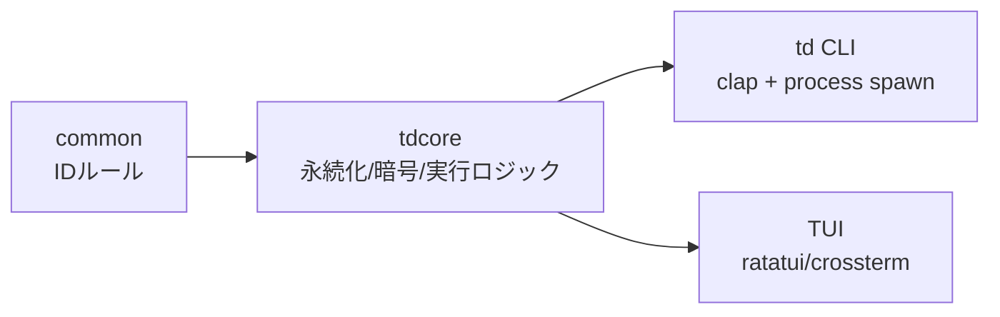
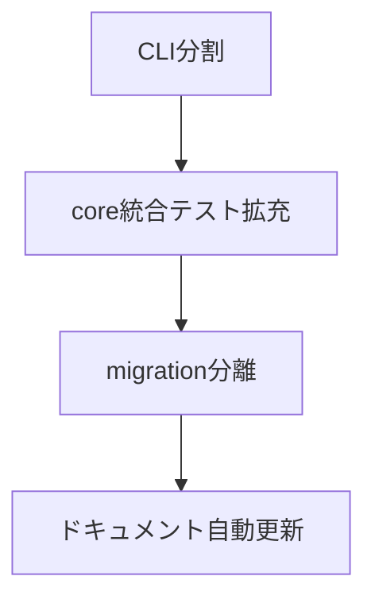

# 🧠 crates配下ソース実装解析

> `create/` ディレクトリは存在しなかったため、実装本体である `crates/` を対象に解析した。

## 1. 全体像

`TeraDock` は Cargo workspace で `common / core / cli / tui` を分離し、UI層（CLI/TUI）から `tdcore` のユースケースを呼ぶ構造になっている。依存方向は「`common -> core -> cli/tui`」で比較的クリーン。 



- Workspace members は4 crate 固定。(`../Cargo.toml:1-6`)
- `tdcore` が SQLite/crypto/validation の主要依存を持つ。(`../crates/core/Cargo.toml:6-20`)
- `td`(CLI) は `tdcore` と `tui` を利用し、運用コマンドの入口を担う。(`../crates/cli/Cargo.toml:27-43`)

## 2. crate別の責務

### 2.1 `crates/common`: ID規約を一元化

`id.rs` は ID 文字種・長さ・予約語を集約し、`generate_id` で規約内IDを作る。

```rust
static ID_REGEX: Lazy<Regex> =
    Lazy::new(|| Regex::new(r"^[a-z0-9][a-z0-9_-]{2,63}$").expect("regex must compile"));

pub fn validate_id(candidate: &str) -> Result<(), IdError> {
    if candidate.is_empty() {
        return Err(IdError::Empty);
    }
    // ...
}
```

参照: `../crates/common/src/id.rs:20-55`

**所見**
- 良い点: IDルールを共通化しており、`profile/secret/session` 系で再利用しやすい。
- 注意点: 予約語集合は手動メンテなので CLI サブコマンド追加時の追従漏れリスクがある。

### 2.2 `crates/core`: ドメイン + 永続化 + 実行基盤

`lib.rs` でモジュール公開し、プロファイル・転送・トンネル・シークレット・診断などを提供。(`../crates/core/src/lib.rs:1-21`)

#### プロファイル管理
- `ProfileType`, `DangerLevel`, `Profile` を定義し、`ProfileStore` が SQLite CRUD を担当。(`../crates/core/src/profile.rs:11-220`)
- `NewProfile::normalize_id()` が `common::id` ルールを適用。(`../crates/core/src/profile.rs:110-118`)

#### DBマイグレーション
- `db::init_connection()` で DB 接続 + migration 実行。(`../crates/core/src/db.rs:7-13`)
- `settings/profiles/secrets/cmdsets/op_logs/sessions` まで1箇所で作成する実装。(`../crates/core/src/db.rs:27-137`)

#### 外部コマンド診断
- `doctor::check_clients_with_overrides()` が profile override -> global override -> PATH の優先順でクライアント解決。(`../crates/core/src/doctor.rs:107-212`)
- SSH agent と ssh_config 警告を同時に収集する。(`../crates/core/src/doctor.rs:126-153`)

#### 秘密情報
- マスター鍵は Argon2id 派生 + 検証トークンで管理。(`../crates/core/src/secret.rs:30-95`)
- Secret 保存は AAD 付き暗号化、復号は `reveal` で実施。(`../crates/core/src/secret.rs:145-235`)

#### 転送・トンネル
- `TransferVia` で `scp/sftp/ftp` を抽象化し、FTP を insecure 扱いできる。(`../crates/core/src/transfer.rs:16-54`)
- `ForwardStore` / `SessionStore` がトンネル設定と起動セッション状態を永続化。(`../crates/core/src/tunnel.rs:67-240`)

### 2.3 `crates/cli`: 業務コマンドの統合入口

`main.rs` では clap のコマンド木を巨大 enum で保持し、profile/config/secret/transfer/tunnel/test/ui まで一本化している。(`../crates/cli/src/main.rs:51-158`)

```rust
#[derive(Debug, Subcommand)]
enum Commands {
    Profile { /* ... */ },
    ConfigSet { /* ... */ },
    Doctor { #[arg(long)] json: bool },
    Exec { profile_id: String, /* ... */ },
    // ...
}
```

参照: `../crates/cli/src/main.rs:58-149`

**所見**
- 強み: 実運用コマンドはほぼ揃っている。
- 課題: `main.rs` が肥大化し、責務（引数解釈/実行/表示）が混在。将来の変更速度を落とす。

### 2.4 `crates/tui`: 対話操作と危険操作ガード

- `run_loop` は event poll -> key handler の単純ループで可読性は高い。(`../crates/tui/src/app.rs:46-74`)
- `AppState` はフィルタ、結果タブ、確認ダイアログ、一括実行管理を担当。(`../crates/tui/src/state.rs:113-137`)
- Danger=Critical の実行時に確認入力を強制する安全策がある。(`../crates/tui/src/state.rs:481-514`)

## 3. 実装観点の評価（率直）

1. **設計の軸は悪くない**: `tdcore` 中心に寄せたのは正解。
2. **ただしCLI肥大化が進行中**: これを放置するとバグ修正の局所化が不可能になる。
3. **migration一枚岩化の限界が近い**: `db.rs` に schema と migrationロジックが密結合。
4. **テスト戦略は局所的**: IDやCLI parseテストはあるが、`core` の統合テストが薄い。

## 4. 優先改善プラン（短期）



1. `crates/cli/src/main.rs` を機能別モジュールに分割（profile/config/transfer等）。
2. `crates/core` に in-memory DB を使う統合テストを追加（profile->run->oplog 連携）。
3. migration SQL をバージョン別ファイルへ分離して diff を追跡可能にする。
4. このページをベースに、変更時に wiki 差分更新をPRチェック化する。

## 5. 関連ドキュメント

- 全体設計は [🏗️ アーキテクチャ](./02-アーキテクチャ.md)
- データ構造は [🗄️ データモデル](./03-データモデル.md)
- テスト計画は [🧪 テストとリリース計画](./06-テストとリリース計画.md)
